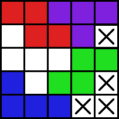
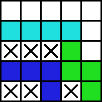
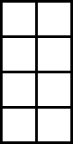

# Nim Tetris - AI (ENG)

Nim Tetris distributions contain strong built-in AIs one can challenge. How are they implemented? 

AIs can be implemented in a primitive way that examines numbers of cases as much as possible and finds the best, of course. However, they would be much slower and weaker if they were actually implemented like that. More sophisticated and efficient methods need to make good AIs. The methods will be introduced here.


## 1. OIS(Optimized Information Set)

### 1) Basic concept

There are many numbers of cases in Nim tetris, but a lot of them are equivalent in terms of the gameplay. For example, while the two board situations below look different, they are equivalent in terms of the gameplay: they contain only one playable area that can be completely filled only with one additional block.

<p float="left"> </p>

This observation shows that the number of meaningful cases to consider may be far smaller than it seems. If we ignore the irrelevant details of the board and leave only *key informations* which matters in terms of the gameplay, the number of cases analysis would be done much more efficiently. It is what this document will refer to as Optimized Information Set, or shortly OIS.

OIS is defined as a set of sets of which elements are given by all possible next-OIS, that is, OIS of the next board can be created when a new block is placed on the given board. The list below shows some examples.

example 1 : A board on which no blocks can be placed corresponds to the empty set,  $ \emptyset $.

<br clear="left"/>

example 2 : A board on which no matter where the next block is placed, no more blocks can be placed on the board so that OIS become $ \emptyset $ is corresponds to the set with only one empty set as an element, $ \{ \emptyset \} $.

<br clear="left"/>

example 3 : A board on which OIS of the next state can be $ \emptyset $ or $ \{\emptyset\} $ depending on the player's choice of the block corresponds to $ \{\emptyset, \{\emptyset\}\} $.

<br clear="left"/>

This analysis reduces the number of cases to consider greatly. Number of cases on the board still need to checked to obtain OIS, but not all of them have to be checked now. For example, OIS of a board having only one playable area of 4-7 cells is clearly $\{\emptyset\}$ so that one doesn't have to check the cases of which put blocks on it.

The OIS-based analysis become much stronger when they are applied to boards which are separated with multiple playable areas. How to calculate the OIS of a separated board will be dealt in the next section.


### 2) Calculating OIS of Separated Boards

<br clear="left"/>

The board in the picture is separated into two playable areas of 8 cells. What is the OIS of this board? One can find it by putting blocks in one by one, but there is a better way: to calculate OIS of the separated areas and calculating the OIS of the whole board using them.

<p float="left"> </p>

In this case, both area have OIS of $ \{\emptyset, \{\emptyset\}\} $. What is the OIS of the whole board then? It is a set of which elements are all possible next-OIS after play. And in terms of OIS, there are only four possible plays in this situation.

1.	Change the OIS of the left area to $ \emptyset $.
2.	Change the OIS of the left area to $ \{\emptyset\} $.
3.	Change the OIS of the right area to $ \emptyset $.
4.	Change the OIS of the right area to $ \{\emptyset\} $.

It's also clear that there is no difference between the first and third options in terms of OIS. The second and fourth options are also equivalent. After combining the equivalents, following two options are obtained.

1. Change the OIS of the an area to $ \emptyset $.
2. Change the OIS of the an area to $ \{\emptyset\} $.

OIS of the board would have the the next-OIS obtained in each case as its element. Let us denote OIS of a board consist of an area of which OIS is $ X $ and an area of which OIS is  $ Y $ as $ X\times Y $. The first option give the next-OIS of $ \emptyset\times \{\emptyset,  \{\emptyset\}\} $, while the second one give $ \{\emptyset\}\times \{\emptyset,  \{\emptyset\}\} $. The following expression holds.

$  \{\emptyset,  \{\emptyset\}\}\times \{\emptyset,  \{\emptyset\}\} =  \{\emptyset\times \{\emptyset,  \{\emptyset\}\},  \{\emptyset\}\times \{\emptyset,  \{\emptyset\}\}\}. $

Since blocks cannot be placed in an area of which OIS is $ \emptyset $, they have no effect on the number of cases in the game whatsoever and $ \emptyset\times X $ always equals $ X $. The first element $ \emptyset\times \{\emptyset,  \{\emptyset\}\} $ is just $ \{\emptyset,  \{\emptyset\}\} $.

How to calculate the second element, $ \{\emptyset\}\times \{\emptyset,  \{\emptyset\}\} $? Just repeat the method applied previously. In this case, there are only three possible plays.

1. Change OIS of the area of which OIS is $ \{\emptyset\} $ to $ \emptyset $.
2. Change OIS of the area of which OIS is $ \{\emptyset,  \{\emptyset\}\} $ to $ \emptyset $.
3. Change OIS of the area of which OIS is $ \{\emptyset,  \{\emptyset\}\} $ to $ \{\emptyset\} $.

The first option makes the next-OIS to $ \{\emptyset,  \{\emptyset\}\} $ and the secone one makes it to $\{\emptyset\} $. The thirs one makes the next-OIS to $ \{\emptyset\}\times \{\emptyset\} $ and it turns out to be $ \{ \{\emptyset\}\} $. We just shown that

$  \{\emptyset\}\times \{\emptyset,  \{\emptyset\}\} =  \{ \{\emptyset,  \{\emptyset\}\},  \{\emptyset\},  \{ \{\emptyset\}\}\}, $

therefore,

$ \{\emptyset,  \{\emptyset\}\}\times \{\emptyset,  \{\emptyset\}\} =  \{ \{\emptyset,  \{\emptyset\}\},  \{ \{\emptyset,  \{\emptyset\}\},  \{\emptyset\},  \{ \{\emptyset\}\}\}\}. $

This logic is applicable even when the OIS is very large. In general, for $ X =  \{x_1, x_2 \cdots x_n\} $ and $ Y =  \{y_1, y_2 \cdots y_m\} $, folloing expressions holds.

$ X\times Y =  \{x_1\times Y, x_2\times Y \cdots x_n\times Y, X\times y_1, X\times y_2 \cdots X\times y_m\}. $

The calculation, of course, requires recursive work. If the depth of the two operand OIS is very deep, it is likely to take quite a long time to compute. Thankfully in Nim tetris, same OIS tends to appear over and over again.

By saving the result of calculations previously optained in memory, one can optain results much faster by simply loading the saved data when the same calculations have to be done. This optimization is one of the biggest reason why those built-in AIs can find the best play so quickly even in seemingly complex board state.


### 3) OIS-based Win-or-Loss Judgement

If a board can be analyzed via its OIS, how can it tell us which player are winning, and what he have to do to secure the win? 

It's simple. Just think that the two players are playing not Nim tetris, but some imaginary game which is only based on OIS, where the two players taking turns choosing an element of the OIS and replacing it with the chosen. The game ends when the OIS become the empty set, and the one who played last lose. 

Since $ \{\emptyset\} $ only has empty set as an element, the first player to play when OIS is $ \{\emptyset\} $ always lose. If `is_winable` is a function returning whether the first player can win with given OIS, the following holds.

```
is_winable('{0}') == false
```

In contrast, if the given OIS has $ \{\emptyset\} $ as an element, the first player can always win by choosing $ \{\emptyset\} $. For example, the following holds.

```
is_winable('{{0}, 0}') == true
```

This rule can be generalized easily. In general, when $ A $ is an OIS, if there is at least one element $a$ of `A` which satisfies `is_winable(a) == false`, `is_winable(A)` is `true` and choosing `a` is the best play for the first player to win.

What if there are no element `a` satisfying `is_winable(a) == false`? It means that no matter what first player choose, the opponent can always counter it and secure the win. Therefore, `is_winable(A)` is `false`. The only exception is $\emptyset$. It does not have any element, but it only means that the previous player made the last play and lose. Therefore, the first player wins by default.

```
is_winable('0') == true
```

The winning play found in the OIS game is important since it can be translated into the winning play of Nim tetris directly. If choosing certain OIS is the best play in the OIS game, the plays changing OIS of the board into the same OIS are always the best plays in Nim tetris.

Built-in AIs in the Nim Tetris distributions has various OIS-based optimizations other than those described in this article. For more specific details or implementations, see files in [*src/Nim tetris/AI*](src/Nim tetris/AI) folder, especially [*OptimizedInformationSet.h*](src/Nim tetris/AI/OptimizedInformationSet.h).


## 2. Bit-compressing

Although OIS-based analysis reduces the number of practical cases to consider greatly, one still have to check a lot of cases on board to obtain OIS of each playable areas. It still takes quite a long to find OIS by putting blocks in playable areas one by one.

Built-in AIs solve this problem through bit-compression. Each cells on the board can have two logical state: filled(1) or not filled(0). By storing state of each cells in only 1 bit, one can store the logical state of the whole board only using 100 bits, which is smaller than 16 byte.

Why use bit-compression? Because it makes the analysis on the board much faster. There are roughly 3 reasons. 

- The process of checking cases in a board often requires the task making multiple copies of it. By using bit-compressed board instead, one can make a lot of copies with little to no memory overhead. This greatly improves not only the memory efficiency of the algorithm, but also its performance.
- With bit-compression, operations such as determining whether a block can be placed on a board or placing a block on a board can be performed quickly with [bitwise And](https://en.wikipedia.org/wiki/Bitwise_operation#AND) and [bitwise Or](https://en.wikipedia.org/wiki/Bitwise_operation#OR). This is much faster than using the coordinates. 
- bit-compression also make the task finding separated areas in board, i.e, the *Connected component labeling (CCL)* much faster. The task is performed repeatedly in the OIS-finding process, so that the speed of it has a decisive effect on the speed of OIS calculations, and furthermore, on the speed of the best play finding algorithm itself.

How can CCL on a bit-compressed board run much faster? The CCL algorithm specialized on the bit-compressed input, *BRTS* makes it possible.  

*BRTS* is one of the two CCL algorithms proposed in [UFBL](https://github.com/attltb/UFBL). It is the fastest known the CCL algorithm as of 2022, especially for the 4-connectivity we need here. For the details of the algorithm itself, see [this](https://github.com/attltb/UFBL/blob/main/Labeling_BRTS.md).
