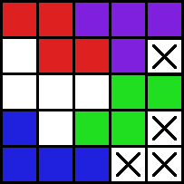

# Nim Tetris - AI (KOR)

Nim tetris의 배포판에는 대결해 볼 수 있는 빠르고 강력한 AI들이 내장되어 있습니다. 이 AI들은 어떻게 구현됩니까?

단순히 가능한 모든 경우의 수를 검토해 보고 최선의 수를 찾는 방식으로 구현하면 될 것 같지만, 그 방법으로는 훨씬 더 느리고 약한 AI 밖에 만들 수 없습니다. Nim tetris 배포판에 포함된 AI의 실제 구현 원리는 이 문서에서 다루어집니다.


## 1. 최적화 정보 집합 (OIS; Optimized Information Set)

### 1) 기본 개념

Nim tetris에는 많은 경우의 수가 있지만 그 중 상당수는 게임 플레이의 측면에서 보면 동등합니다. 가령, 아래의 두 보드 상황은 달라 보이지만 블록 하나로 완전히 채워질 수 있는 유효 영역 하나로 이루어져 있다는 건 마찬가지입니다.

<p float="left"> </p>

이것은 게임에서 고려해야 할 유의미한 경우의 수는 보기보다 훨씬 적으며, 보드의 복잡한 세부 사항을 무시하고 실제 게임플레이에 중요한 핵심 정보만 남긴다면 경우의 수 분석을 훨씬 더 효율적으로 할 수 있다는 것을 말해 줍니다. 이 문서에서 최적화 정보 집합(OIS; Optimized Information Set) 이라고 부를 것이 바로 그것입니다.

OIS는 주어진 보드에 새로운 블록을 놓았을 때 만들어질 수 있는 구분되는 모든 가능한 다음 상황의 OIS를 원소로 하는 집합의 집합으로 정의됩니다. 아래는 그것의 몇 가지 예를 보여줍니다.

사례1 : 그 어떠한 블록도 놓을 수 없는 상태는 공집합 $ \emptyset $ 에 대응됩니다. 

<br clear="center"/>

사례2 : 어디에 블록을 놓더라도 다음에 더 이상 블록을 놓을 수 없는 상태가 되는 상태는 공집합 하나만을 원소로 하는 집합, 즉 $ \{ \emptyset \} $에 대응됩니다.

<br clear="center"/>

사례3 : 플레이어의 선택에 따라 다음 상황의 OIS를 $ \emptyset $으로도, $ \{\emptyset\} $으로도 만들 수 있으며 그 외의 선택지가 없는 상태는 $ \{\emptyset, \{\emptyset\}\} $에 대응됩니다.

<br clear="center"/>

이러한 분석은 실질적으로 고려해야 할 게임의 경우의 수를 크게 줄여 줍니다. 보드에 대한 경우의 수 분석은 OIS를 얻는 과정에서 여전히 필요하지만 이를 위해 모든 경우의 수를 다 조사할 필요는 없기 때문입니다. 가령 4칸 이상 7칸 미만의 유효 영역은 무조건 {0}을 OIS로 가지며, 이는 굳이 일일히 블록을 넣어 보지 않아도 명확합니다.

OIS 기반 분석은 여러 개의 유효 영역으로 분할되어 있는 보드를 분석할 때 특히 더 강력한 힘을 발휘합니다. 분할된 보드의 OIS를 계산하는 방법은 다음 절에서 다루어집니다.


### 2) 분할된 보드의 OIS 계산


위 보드는 8칸짜리 유효 영역 두 개로 나뉘어져 있습니다. 이 보드의 OIS는 무엇입니까? 일일히 블록을 넣어 가며 확인해 볼 수도 있지만 더 좋은 방법이 있습니다. 분할된 두 유효 영역 각각의 OIS를 먼저 구하고 이를 이용해 전체 보드의 OIS를 구하는 것입니다.

<p float="left"> </p>

이 경우 분할된 두 유효 영역의 OIS는 모두 $ \{\emptyset, \{\emptyset\}\} $로 밝혀집니다. 그렇다면 전체 보드의 OIS는 무엇입니까? 그것은 이 상황에서 플레이가 이루어진 후의 가능한 모든 다음 상황의 OIS를 원소로 하는 집합과 같습니다. 그리고 OIS의 측면에서 이 상황에서 가능한 플레이는 네 가지 뿐입니다.

1.	왼쪽 유효 영역의 OIS를 $ \emptyset $ 으로 만들기
2.	왼쪽 유효 영역의 OIS를 $ \{\emptyset\} $ 으로 만들기
3.	오른쪽 유효 영역의 OIS를 $ \emptyset $ 으로 만들기
4.	오른쪽 유효 영역의 OIS를 $ \{\emptyset\} $ 으로 만들기

OIS의 측면에서 보면 첫 번째 선택지와 세 번째 선택지, 두 번째 선택지와 네 번째 선택지 사이에 아무런 차이가 없다는 것은 명확합니다. 중복되는 선택지를 합치면 다음 두 개의 선택지가 얻어집니다.

1. 한 유효 영역의 OIS를 $ \emptyset $ 으로 만들기
2. 한 유효 영역의 OIS를 $ \{\emptyset\} $ 으로 만들기

전체 보드의 OIS는 각 경우에 얻어지는 다음 상황의 OIS를 모두 원소로 하는 집합일 것입니다. OIS가 $ X $인 유효 영역과 OIS가 $ Y $인 유효 영역으로 이루어진 보드의 OIS를 $ X\times Y $로 나타낸다면 이는 다음이 성립함을 의미합니다.

$  \{\emptyset,  \{\emptyset\}\}\times \{\emptyset,  \{\emptyset\}\} =  \{\emptyset\times \{\emptyset,  \{\emptyset\}\},  \{\emptyset\}\times \{\emptyset,  \{\emptyset\}\}\}. $

물론 OIS가 $ \emptyset $인 영역은 게임의 남은 경우의 수에는 아무런 영향을 끼치지 않으므로 임의의 $ X$ 에 대해  $ \emptyset\times X $는 $ X $와 같습니다. 결과의 첫 번째 원소, $ \emptyset\times \{\emptyset,  \{\emptyset\}\} $은 $ \{\emptyset,  \{\emptyset\}\} $입니다.

두 번째 원소, $ \{\emptyset\}\times \{\emptyset,  \{\emptyset\}\} $​는 어떻게 계산합니까? 앞에서 적용한 방법을 반복하면 됩니다. 이 경우 가능한 플레이는 세 가지 뿐입니다.

1. OIS가 $ \{\emptyset\} $인 유효 영역의 OIS를 $ \emptyset $ 으로 만들기
2. OIS가 $ \{\emptyset,  \{\emptyset\}\} $인 유효 영역의 OIS를 $ \emptyset $ 으로 만들기
3. OIS가 $ \{\emptyset,  \{\emptyset\}\} $인 유효 영역의 OIS를 $ \{\emptyset\} $ 으로 만들기

첫 번째 선택지는 다음 OIS를 $ \{\emptyset,  \{\emptyset\}\} $로, 두 번째 선택지는 다음 OIS를 $ \{\emptyset\} $로 만듭니다. 세 번째 선택지는 다음 OIS를 $ \{\emptyset\}\times \{\emptyset\} $으로 만드며, 이것은 $ \{ \{\emptyset\}\} $과 같음이 밝혀집니다. 다음이 성립합니다.

$  \{\emptyset\}\times \{\emptyset,  \{\emptyset\}\} =  \{ \{\emptyset,  \{\emptyset\}\},  \{\emptyset\},  \{ \{\emptyset\}\}\}, $

따라서,

$ \{\emptyset,  \{\emptyset\}\}\times \{\emptyset,  \{\emptyset\}\} =  \{ \{\emptyset,  \{\emptyset\}\},  \{ \{\emptyset,  \{\emptyset\}\},  \{\emptyset\},  \{ \{\emptyset\}\}\}\}. $

이러한 논리는 물론 OIS가 큰 경우에도 적용 가능합니다. 일반적으로 $ X =  \{x_1, x_2 \cdots x_n\} $와 $ Y =  \{y_1, y_2 \cdots y_m\} $에 대해 다음이 성립합니다.

$ X\times Y =  \{x_1\times Y, x_2\times Y \cdots x_n\times Y, X\times y_1, X\times y_2 \cdots X\times y_m\}. $

이 계산은 물론 재귀적인 작업을 필요로 합니다. 두 피연산자 OIS의 깊이가 깊어질 경우 꽤 긴 시간이 계산에 소요될 가능성이 높습니다. 하나 다행인 부분은 Nim tetris에서는 동일한 OIS가 반복해서 등장하는 경향이 있다는 것입니다.

이전에 수행된 OIS의 곱 계산의 결과를 메모리에 저장해 두면 나중에 같은 두 OIS를 곱해야 할 때 단순히 저장된 결과를 로드함으로써 직접 다시 계산을 수행하는 것보다 훨씬 더 빠르게 결과를 얻을 수 있습니다. 이러한 전략은 이들 AI들이 거의 시간을 쓰지 않고도 분할 기반의 최선의 수를 빠르게 찾아낼 수 있게 하는 가장 큰 비결이라 할 수 있습니다.


### 3) OIS기반의 승패 판정

보드 상황을 OIS를 통해 분석할 수 있다면 각 보드 상황에서 선공이 승리할 수 있는지, 그 방법이 무엇인지는 OIS로부터 어떻게 판정할 수 있습니까? 

간단합니다. 단순히 양 플레이어가 Nim tetris대신 OIS만을 가지고 하는 어떤 가상의 게임을 하고 있다고 생각하십시오. 각 플레이어는 자신의 턴에 OIS의 원소 중 하나를 골라 그것으로 OIS를 대체합니다. 게임은 OIS가 공집합이 되는 순간 끝나며, 이 때 마지막으로 플레이한 사람이 패배하게 됩니다.

$ \{\emptyset\} $에는 원소가 공집합 하나밖에 없으며 공집합을 선택하는 순간 게임이 종료되므로 OIS가 $ \{\emptyset\} $인 상황에서 먼저 플레이하는 사람은 무조건 패배합니다. OIS게임의 승리 가능 여부를 판정하는 함수가 `is_winable`이라면 다음이 성립합니다.

```
is_winable('{0}') == false
```

반대로 주어진 OIS가 $ \{\emptyset\} $을 원소로 가지고 있다면 선공은 OIS를 $ \{\emptyset\} $으로 바꾸고 턴을 넘김으로써 무조건 승리 가능합니다. 가령, 다음이 성립합니다.

```
is_winable('{{0}, 0}') == true
```

이러한 원리는 쉽게 일반화될 수 있습니다. 일반적으로, $A $가 OIS라고 할 때, $A$의 원소 중 `is_winable(a)`가 `false`인 원소 $a$가 하나라도 있다면 `is_winable(A)`는 `true`가 되며, 이 경우 OIS를 $ a$로 만드는 플레이가 바로 그 상황에서 승리할 수 있는 최선의 플레이가 됩니다.

$A$에 `is_winable(a)`가 `false`인 원소가 없다면 어떻게 됩니까? 이것은 먼저 플레이하는 사람이 무엇을 선택하든 상대는 항상 승리할 수 있는 방법이 있다는 것을 의미합니다. 즉, `is_winable(A)`는 `false`가 됩니다. 유일한 예외는 $ \emptyset $입니다. $ \emptyset $에는 아무 원소도 없지만, 이것은 전에 플레이한 플레이어, 즉 상대가 게임의 마지막 블록을 놓았다는 것을 의미하므로 플레이어는 자동으로 승리합니다.

```
is_winable('0') == true
```

OIS 게임의 승리 전략은 그 OIS에 상응하는 보드 상황을 가진 Nim tetris의 승리 전략으로 직접적으로 치환될 수 있기 때문에 중요합니다. OIS게임에서 특정한 OIS를 고르는 것이 최선의 플레이라면, Nim tetris에서도 보드 상황을 바로 그 OIS를 가진 보드 상황으로 바꾸는 플레이가 항상 최선의 플레이가 됩니다.

Nim tetris의 AI에는 이 문서에서 설명한 것 외에도 다양한 OIS기반의 최적화가 적용되어 있습니다. 구현이나 구체적인 세부 사항에 대해서는 [*src/Nim tetris/AI*](src/Nim tetris/AI) 폴더의 파일들, 특히 [*OptimizedInformationSet.h*](src/Nim tetris/AI/OptimizedInformationSet.h) 파일을 참조하십시오.


## 2. 비트 압축

OIS가 게임의 실질적인 경우의 수를 크게 줄여 준다고는 하나, OIS를 얻는 과정은 여전히 각 유효 영역에 대한 경우의 수 분석을 필요로 합니다. 일일히 유효 영역에 블록을 놓아 가며 OIS를 확인하는 일에는 상당히 긴 시간이 소모됩니다.

기본 AI들은 보드의 비트 압축을 통해 이 문제를 해결합니다. 보드의 각 칸은 블록으로 채워져 있는 상태(1)와 채워지지 않은 상태(0)의 두 가지 상태 중 하나를 가질 수 있습니다. 각 칸의 상태를 1비트에 저장한다면 10x10크기의 보드 전체의 상태를 100비트, 즉 16바이트보다 작은 이진 데이터 안에 충분히 저장할 수 있습니다.

왜 비트 압축을 사용합니까? 그것이 보드 분석을 훨씬 더 빠르게 해 주기 때문입니다. 여기에는 크게 3가지 이유가 있습니다.

- 보드의 분석 과정은 여러 번 보드의 사본을 만드는 작업을 필요로 합니다. 비트 압축을 사용하면 메모리에 거의 부담을 주지 않고도 많은 수의 보드 사본을 만들 수 있으며, 이는 알고리즘의 메모리 효율 뿐 아니라 속도도 크게 향상시켜 줍니다.
- 비트 압축을 사용하면 보드에 블록을 놓을 수 있는지 판정하거나 보드의 블록을 놓는 등의 연산을 비트 And, 비트 Or을 통해 빠르게 수행할 수 있습니다. 이는 블록의 좌표를 직접 이용하는 것보다 훨씬 빠르고 효율적입니다.
- 비트 압축은 보드를 여러 유효 영역으로 나누는 작업, 즉 연결 요소 레이블링(CCL; Connected component labeling)도 더 빠르게 수행될 수 있게 합니다. CCL은 OIS의 계산 과정에서 반복적으로 수행되며, 따라서 이 작업의 속도는 OIS계산의 속도, 나아가 최선의 플레이 찾기 알고리즘 자체의 속도에 결정적인 영향을 줍니다.

어떻게 비트 압축된 보드의 연결 요소를 더 빨리 찾을 수 있습니까? AI가 사용하는 비트 압축된 데이터 전용의 CCL알고리즘, BRTS가 그것을 가능하게 합니다.

BRTS는 이 github의 또 다른 프로젝트, [UFBL](https://github.com/attltb/UFBL)에서 제안된 두 CCL알고리즘 중 하나이며 2022년까지 알려진 4-연결 요소 레이블링 알고리즘 중에서는 가장 빠른 알고리즘입니다. 알고리즘의 구체적인 세부 사항에 대해서는 [이 문서]((https://github.com/attltb/UFBL/blob/main/Labeling_BRTS.md))를 참조하십시오. 
