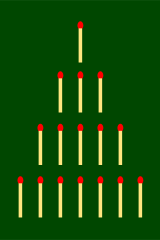
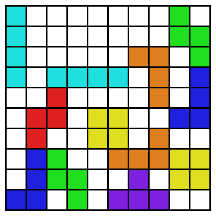

# Nim Tetris (ENG)

## About

Nim tetris is a [Nim](https://en.wikipedia.org/wiki/Nim)-like strategic board game that uses [tetrominoes](https://en.wikipedia.org/wiki/Tetromino).

### 1) What is Nim?

Nim is a game played by placing a fixed number of stones (or matchsticks, etc.) across several rows, and then the two players take turns removing the stones. The following picture shows the initial placement of stones most commonly used, namely (1, 3, 5, 7).

Players must remove at least one stone at his turn. Removing multiple stones at once is allowed only if they come from the same row. For example, given the initial arrangement of stones as above, the first player to play can remove one stone from the second row or all 7 stones from the fourth row, but cannot remove one stone from each row.

The game ends when all stones in the board are removed, and the one removed the last stone loses. In other words, to win the game, one must leave one last stone to the opponent so that he has no choice but to remove it.

### 2) What is Nim tetris?

Nim tetris is played by two players taking turns placing [tetrominos](https://en.wikipedia.org/wiki/Tetromino) on a 10x10 board. Blocks can be placed anywhere on the board, but cannot be overlapped. The game ends when there are no more places to put blocks on the board, and the one put the last block loses.

Note that not all places on the board have to be filled to satisfy the end of game conditions. It's clear that the emply place in the upper right corner of the picture will not be filled until the game is over. For convenience, the game may mark thoses places where no blocks can be placed so that they can be considered filled with the mark instead of blocks. In this case, the game ends when all places on the board are filled with blocks or the mark.

Nim tetris is similar to the Nim in many respects but its two-dimensional elements give the game a depth that the original Nim lacks. See [this](Strategy.eng.md) for various strategies to win the game. Nim tetris distributions also contain strong built-in AIs one can challenge. These AIs are easily the most interesting part of the program. See [this](Strategy.eng.md) for the implementation. 

## Control

Mouse/Arrow- move cursur block

A - change cursur block (Z $\rightarrow $ S $\rightarrow $  T $\rightarrow $ J $\rightarrow $ L $\rightarrow $ O $\rightarrow $ I $\rightarrow $ Z)

S - rotate cursur block

D - change cursur block (I $\rightarrow $ O $\rightarrow $ L $\rightarrow $ J $\rightarrow $ T $\rightarrow $ S $\rightarrow $ Z $\rightarrow $ I)

Enter / left mouse click - put block

R - surrender

Q - change background image

## Installation

To play the game, download the latest Nim tetris release for the operating system you want to run the game in from the release tab on the right. (Currently, only a version for Windows operating system is available.)

If you want to build the binary from the source code, follow the steps below.

1. Download and install the latest version of Cmake for your system from https://cmake.org. You can skip this step Cmake 3.13 or higher is already installed.

2. Clone the GitHub repository (-) or download it as a zip file and extract to any folder you want.

3. Run Cmake-gui, enter the folder where the repository is cloned in (1) and the folder where the project will be installed in (2), and click (3). 

   

4. Select a build system you want to use to build the Nim Tetris project. At least one C++ build system must already be installed to pass this step.

5. When the language and other options appear in the Cmake-gui window, select the language and click (3) again. When you're done, click (4) and again when you're done, click (5).

6. Build the Nim Tetris project using the build system you choose.

If you just run the built binary you will get an error saying that the file 'Nim tetris.dat' is missing. Download 'Nim tetris.dat' from the release tab on the right and put it in the folder where the binary is installed. You should be able to execute the binary after everything is done.

## Contributors

<a href="https://github.com/attltb">attltb</a> - game design and programming, AI design and programming, graphic design(~ver.0.1), etcs.

Contributions of any kind welcome.
