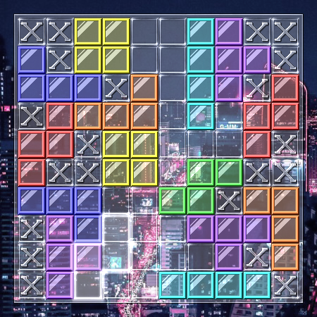
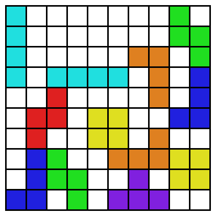
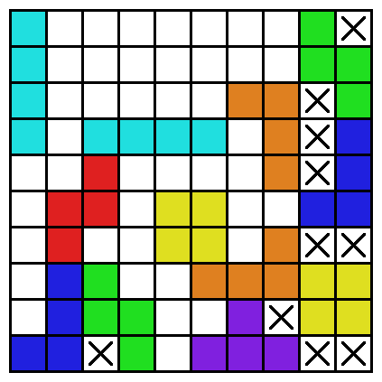
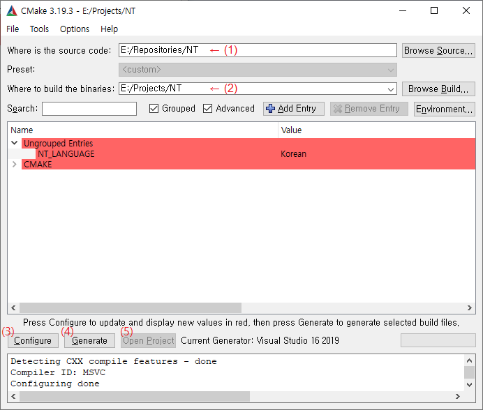

# Nim Tetris (KOR)

## 게임소개

Nim tetris는 테트로미노를 이용하는 [Nim](https://en.wikipedia.org/wiki/Nim)과 유사한 2인 전략 보드 게임입니다.

### 1) Nim은 무엇입니까?

Nim은 몇 개의 줄에 걸쳐 돌(또는 성냥개비 등)을 정해진 갯수만큼 놓아 둔 후 두 플레이어가 번갈아 가며 돌을 제거해 나가는 방식으로 진행됩니다. 다음 그림은 가장 대중적으로 사용되는 (1, 3, 5, 7) 형태의 돌의 초기 배치 방법을 보여 줍니다.

각 플레이어는 자신의 턴에 최소한 1개 이상의 돌을 제거해야만 하며, 반드시 하나의 줄에서만 제거해야 합니다. 가령, 위와 같이 초기 돌의 배치가 주어졌다면 선공은 두 번째 줄에서 돌 하나를 제거할 수도, 네 번째 줄의 돌 7개 전체를 제거할 수도 있지만 각 줄에서 돌을 하나씩만 제거하는 등의 행위는 금지됩니다.

게임은 보드 위의 모든 돌이 제거되었을 때 끝나며, 이 때 마지막으로 돌을 제거한 사람이 패배합니다. 즉, 어떻게 해서든 상대방에게 마지막 돌 하나를 남겨서 그것을 제거할 수밖에 없도록 하는 것이 게임의 승리 방법입니다.

### 2) Nim tetris는 무엇입니까?

Nim tetris는 10x10크기의 보드에 두 플레이어가 번갈아 가며 테트로미노를 놓으면서 진행됩니다. 블록은 보드 위의 어느 위치에든 놓을 수 있으나 겹쳐서 놓을 수는 없습니다. 게임은 더 이상 보드 위에 블록을 놓을 자리가 없게 되었을 때 종료되며, 이 때 마지막으로 블록을 놓은 사람이 패배하게 됩니다.

게임의 종료 조건을 만족시키기 위해 반드시 보드의 모든 칸이 채워질 필요는 없다는 데 주목하십시오. 가령, 그림에서 오른쪽 위 모서리의 빈칸은 게임이 끝날 때까지 그 어떤 블록으로도 채워질 수 없습니다. 편의를 위해, 게임은 더 이상 블록을 넣을 수 없는 이런 작은 영역들을 특별히 표시합니다. 이 영역들은 블록 대신 표시로 채워진 것으로 간주될 수 있으며, 게임은 보드 위의 모든 자리가 블록 또는 이 표시로 채워졌을 때 종료됩니다.

Nim tetris는 앞서 소개한 Nim과 여러 면에서 유사하지만, 그것이 가진 입체적인 요소는 게임에 원본 Nim에는 없는 깊이를 제공합니다. 게임에서 승률을 높일 수 있는 각종 전략에 대해서는 [이 문서](Strategy.kor.md)를 참조하십시오. Nim tetris에서 가장 흥미로운 요소 중 하나는 내장된 AI와의 대전입니다. 내장된 AI의 구현 원리에 대해서는 [이 문서](Strategy.kor.md)를 참조하십시오.

## 조작 방법

마우스/방향키 - 블록 이동

A - 블록 바꾸기 (Z $ \rightarrow $  S $ \rightarrow $  T $ \rightarrow $ J $ \rightarrow $ L $ \rightarrow $ O $ \rightarrow $ I $ \rightarrow $ Z)

S - 블록 회전

D - 블록 바꾸기 (I $ \rightarrow $ O $ \rightarrow $ L $ \rightarrow $ J $ \rightarrow $ T $ \rightarrow $ S $ \rightarrow $ Z $ \rightarrow $ I)

Enter / 마우스 좌클릭 - 블록 놓기

R - 기권

Q - 배경화면 바꾸기

## 설치

게임을 플레이하려면 오른쪽의 release탭에서 게임을 실행하려는 운영 체제를 위한 최신의 Nim tetris 버전을 다운로드하십시오. (현재는 Windows 운영 체제용 버전만 제공됩니다.)

소스 코드로부터 직접 바이너리를 빌드하려면 아래의 과정을 따르십시오.

1. https://cmake.org 에서 여러분의 운영 체제에 맞는 최신의 Cmake버전을 다운로드하여 설치하십시오. Cmake 3.13 이상 버전이 이미 설치되어 있다면 이 단계는 건너뛰어도 좋습니다.

2. Github 저장소 (-)를 복제하거나 다운로드하여 알맞은 폴더에 복사합니다.

3. Cmake-gui를 실행시킨 후 (1)에 저장소가 복제된 폴더를, (2)에 프로젝트를 설치할 폴더를 입력하고 (3)을 클릭합니다.

   

4. 대화 상자에서 Nim Tetris 프로젝트를 빌드할 때 사용할 빌드 시스템을 선택하십시오. 이 단계를 통과하려면 최소한 하나 이상의 C++ 빌드 시스템이 이미 설치되어 있어야 합니다. 

5. 언어와 기타 옵션을 선택할 수 있는 항목들이 Cmake-gui창 안에 나타나면 언어를 선택하고 다시 (3)을 클릭합니다. 작업이 끝나면 (4)를 클릭하고 다시 작업이 끝나면 (5)를 클릭합니다.

6. 선택한 빌드 시스템을 이용하여 Nim Tetris 프로젝트를 빌드합니다. 

빌드된 바이너리를 그냥 실행하면 Nim tetris.dat 파일을 찾을 수 없다는 오류가 발생할 것입니다. release탭에서 Nim tetris.dat파일을 복사하여 바이너리가 설치된 폴더에 넣으십시오. 모든 작업이 끝나면 게임을 실행시킬 수 있을 것입니다.

## 기여자

<a href="https://github.com/attltb">attltb</a> - 게임 디자인, AI 설계, 그래픽 디자인(~ver.0.1) 등 작업 전반

모든 종류의 기여는 환영합니다.
