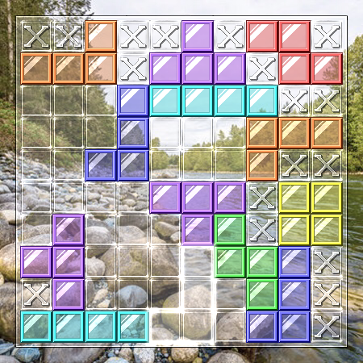

# Nim Tetris

 

Nim tetris is a [Nim](https://en.wikipedia.org/wiki/Nim)-like strategic board game that uses [tetrominoes](https://en.wikipedia.org/wiki/Tetromino).

## README Editions

- [한국어](README.kor.md)
- [English](README.eng.md)

