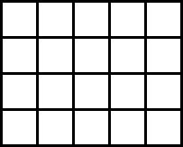
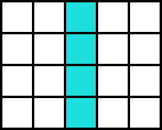
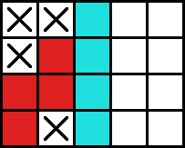
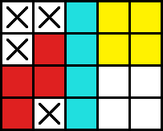
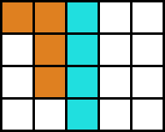
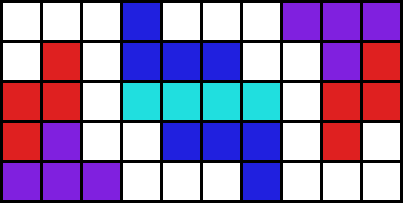
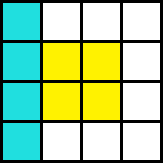
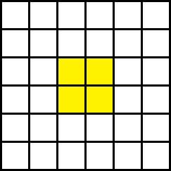
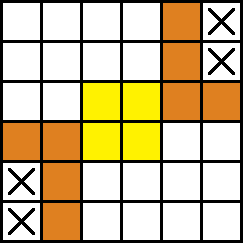

# Nim Tetris - Strategy (ENG)

There are several useful strategies in Nim tetris which can increase one's win rate significantly. One can learn them by playing the game themselves, but it's good to know some of them in advance to make the game more fun from the first. This article introduces these strategies.

## 1. Separation of the board

One can greatly reduces remaining practical number of the cases by splitting playable areas of the board into several smaller ones. This form the most basic strategies of Nim tetris, which allows you to secure the victory at once even in seemingly complex situations.

### 1) Example 1: (2, 2) separation

It seems difficult to find the best play in board like this where there still are 20 playable empty cells in the board. However, there is one simple way to secure the victory for the first player to play. If you want to solve the problem yourself, don't unfold the content below until you find the answer.

See the answer

Divide the board into two playable areas of 8 cells using I-blocks as shown below.

The opponent can not win by any means now. If he uses all cells up in an area, you will be able to force him to put the last block by leaving 4 cells in the other area.

Conversely, if the opponent leaves 4 cells in an area, you will be able to force him to put the last block by using all cells up in the other area.

The point is that both areas can be filled with one or two blocks depending on the choice of the player who put the first block in them. This makes no matter what play the opponent makes in an area, you can counter it in the other area.

This winning method is similar to the (2, 2) winning method of the original Nim game. In Nim, victory is guaranteed by leaving (2, 2) stones to the opponent as shown below.

If your opponent removes one stone in a row, you would be able to force him to remove the last one by removing all the stones in the other row. If your opponent removes all the stones in a row, you would still be able to win by removing only one stone in the other row.

Be careful, for an equal split doesn't always guarantee a win in Nim tetris unlike in the original Nim. The following split divides the board into two equal areas, but the splitter does not win.

In this case, there is no way to use all cells up in an area with one block. If one split the board like this, he would lose. The splitter can secure the win only when the two areas can be filled with one or two blocks. Thankfully, this kind of situation is fairly common in Nim tetris. Knowing a lot of winning separations like this will increase your chance to win greatly.

### 2) Example 2: (1, 2, 3) separation

There are a lot of winning separations known for the game. The following figure shows one of those formulas that comes up often in practice. If the board is spllited like this, the first player to play can not win by any means.

Check for yourself why the first player can't win, and how the opponent can counter each possible play of him.

## 2. Other strateges

### 1) Example 1: Split defense with centering

The first player loses by any other play. There is only one way to win. How? Unfolded the following content to find the answer.

See the answer

Just place the O-block in the center as shown below.

Now, no matter where the opponent play, there will be 8 connected cells remain. You can win by using only 4 cells among the 8 so that the opponent have to fill the last. For example, see the following picture.

Centering is often useful as a way to prevent the separation of the board described above. For example, if there is a block floating in the middle of an area, it is impossible to split it by adding only one block.  

You can split it if you add *two* blocks, but it only means that if you try to split the board thoughtlessly, the opponent will have the chance to split it as they want. This in many cases leads to a favorable outcome for the opponent.

As a result of a hasty split attempt, the opponent's counterattack resulted in the situation of (2, 2) explained above. One may say that you got caught in the opponents' trap.

### 2) Example 2: controlling the number of remaining cells

There are no guaranteed winning strateges at earlier stage of the game. The best thing players can do is just trying to shape the board into the form they are confident to deal with. However, there may exist a strategy that could potentially increase one's odds of winning: controlling the number of remaining alive cells on the board.

One of Nim's well-known derivative in Korea is the [Baskin Robbins 31 game](https://en.termwiki.com/EN/%EB%B2%A0%EC%8A%A4%ED%82%A8%EB%9D%BC%EB%B9%88%EC%8A%A431_%EA%B2%8C%EC%9E%84_%E2%82%80%E2%82%81). It is a simple game where players take turns and say numbers from 1 to 31. Players can say up to 3 numbers at once, and the last person who speaks 31 loses.

The game is also famous for having simple winning strategy when only two players participate in. The first player will say two numbers at his first turn. After that, he will say three numbers if the opponent said one number, two if the opponent said two, and one if the opponent said three. This makes the first number the opponent has to say to form a sequence that increases by 4, which is 3, 7, 11, 15... 31. In the end, the opponent have no choice other than saying 31.

This strategy is partially applicable to Nim tetris as well. In Nim tetris, the number of cells used up in a turn is mostly 4-7. If you control the number of cells used up in your turn according to the number of cells used up by the opponent, you can keep the number of cells used up between opponent turns at 10 or 11.

For example, If you want the remaining number of cells on your opponent's turn to be 25, you will be able to achieve the goal by making the number of cells in your opponent's turn to be 35 or 45 in advance.

Unlike in the Baskin Robbins 31 games, this strategy does not guarantee the victory in Nim tetris. Guaranted winning strateges like the (2, 2) separation introduced earlier are far more important at the later stage of the game. Managing the number of cells may be useful before these guaranted winning strateges can be used, to gain an advantage in the game.
