# Nim Tetris - Strategy (KOR)

Nim tetris에는 알아 두기만 해도 승률을 크게 끌어올릴 수 있는 여러 전략들이 있습니다. 직접 게임을 플레이하면서 배우는 것도 좋지만, 처음부터 게임을 재미있게 플레이하려면 몇 가지 유용한 전략들은 미리 알아 두는 것이 좋습니다. 이 문서는 Nim tetris의 이 전략들을 소개합니다.

## 1. 보드 분할

보드의 남아있는 유효 영역을 여러 개의 작은 유효 영역들로 쪼개면 게임의 남아있는 실질 경우의 수는 크게 줄어듭니다. 이것은 일견 복잡한 상황에서도 단번에 승리를 결정지을 수 있게 해 주는 Nim tetris의 가장 기본적인 전략입니다.

### 1) 사례 1: (2, 2) 분할

 

블록을 놓을 수 있는 자리가 20칸이나 남아 있는 위 보드 상황에서 단번에 승리하는 길을 찾는 것은 어려워 보입니다. 그러나 선공은 확실하게 승리할 수 있는 쉽고 간단한 길이 하나 존재합니다. 스스로 문제를 풀어 보려면 답을 찾을 때까지 아래의 접힌 영역을 열지 마십시오. 

정답 보기

아래와 같이 I블록을 이용하여 보드를 두 개의 8칸짜리 유효 영역으로 쪼개면 됩니다.

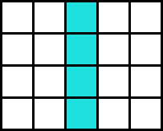 

이제 후공은 어떻게 해도 이길 수 없습니다. 후공이 두 영역 중 하나의 남아있는 빈 공간을 모두 채우면 선공은 다른 한 쪽에서 4칸을 채움으로써 후공이 마지막 블록을 놓을 수밖에 없도록 강제할 것입니다.

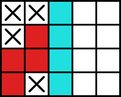 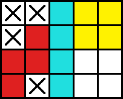

후공이 두 영역 중 한쪽 영역에서 4칸만 채우면 선공은 다른 한 쪽의 8칸을 모두 채움으로써 후공이 마지막 블록을 놓을 수밖에 없도록 강제할 것입니다.

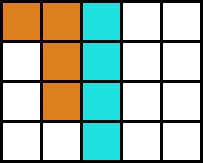 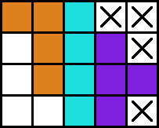

핵심은 두 영역이 모두 블록 하나 또는 두 개로 완전히 채워질 수 있다는 것입니다. 이것이 후공이 한 쪽 영역에서 어떤 플레이를 하더라도 선공이 다른 한 쪽 영역에서 그것에 반대되는 플레이를 통해 후공이 마지막 블록을 놓을 수밖에 없게끔 할 수 있게 합니다.

이러한 승리 공식은 Nim tetris의 모티브가 된 원본 Nim게임의 (2, 2) 승리 공식과도 여러모로 유사합니다. Nim에서는 상대방에게 아래와 같이 (2, 2)개의 돌을 남겨주면 승리가 확정됩니다.

 

상대가 첫 번째 줄에서 한 개의 돌을 제거한다면 당신은 두 번째 줄의 돌 전부를 제거함으로써 상대가 마지막 돌을 제거할 수밖에 없게끔 강제할 수 있습니다. 상대가 첫 번째 줄의 돌 전부를 제거한다면 당신은 두 번째 줄에서 돌 하나만을 제거함으로써 상대가 마지막 돌을 제거할 수밖에 없게끔 강제할 수 있을 것입니다. 상대가 두 번째 줄에서 돌을 가져가도 마찬가지입니다.

Nim에서와 달리 Nim tetris에서는 동등 분할이 항상 승리를 보장하지는 않으므로 주의하십시오. 다음 분할은 똑같이 보드를 같은 영역 두 개로 나누지만 분할자가 승리하지는 않습니다.

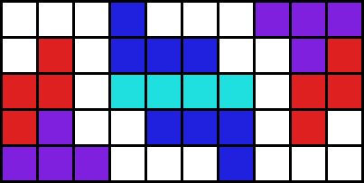 

이 경우 각 영역을 블록 하나만으로 모두 사용하는 방법은 존재하지 않으며, 오직 블록 두 개를 이용하는 방법만 존재합니다. 이렇게 보드를 분할한다면 오히려 분할자가 지게 됩니다.

분할자가 이기는 상황은 오직 보드를 블록 하나 또는 두 개로 완전히 사용될 수 있는 두 영역으로 쪼갤 때만 발생합니다. 다행이 이러한 상황은 Nim tetris에서 상당히 자주 나오는 편입니다. 이와 같은 승리 공식들을 많아 알아 두는 것은 Nim tetris의 승리 확률을 높이는 데 큰 도움이 됩니다.

### 2) 사례 2: (1, 2, 3)분할

Nim tetris에는 (2, 2)외에도 다양한 분할 기반의 승리 공식들이 존재합니다. 다음 그림은 실전에도 자주 나오는 그 공식 중 한 가지를 보여줍니다. 아래와 같이 보드가 분할되어 있다면 선공은 어떻게 해도 이길 수 없습니다.

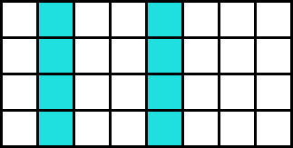 

왜 선공이 이길 수 없는지, 선공의 가능한 각 플레이에 대해 후공은 어떻게 대응해야 이길 수 있는지는 스스로 확인해 보십시오.

## 2. 그 외의 전략들

### 1) 사례 1: 가운데 놓기를 통한 분할 방어

 

선공은 다른 어떤 플레이를 해도 집니다. 이기는 방법은 단 한 가지 뿐입니다. 그 방법은 무엇입니까? 아래의 접힌 영역은 그 답을 보여줍니다.

정답 보기

아래와 같이 가운데에 O블록을 놓으면 됩니다.

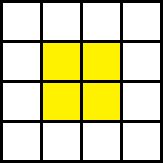 

이제 후공이 어디에 어떻게 블록을 채우든 길게 이어진 8개의 칸이 남게 되며, 따라서 선공은 무효 영역을 만들지 않고 남은 8개의 칸 중 4개의 칸만을 사용함으로써 마지막 블록을 후공이 놓을 수밖에 없게 강제할 수 있습니다. 가령, 다음 그림을 참조하십시오.

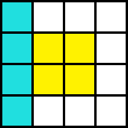 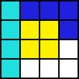

일반적인 상황에서 가운데 놓기는 앞서 설명한 보드 분할을 적극적으로 방어하는 전략으로써 사용되는 경우가 많습니다. 가령, 아래와 같이 가운데에 떠 있는 블록이 있다면 보드를 블록 하나만을 추가하여 크게 분할하는 것은 불가능합니다.

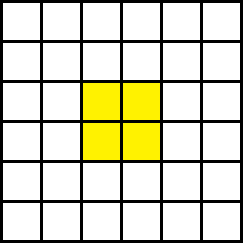 

블록 두 개를 추가한다면 보드를 분할할 수 있으나, 이는 이 상황에서 한 플레이어가 함부로 분할을 시도할 경우 오히려 상대가 자신이 원하는 형태로 보드를 분할할 권리를 갖게 된다는 것을 의미합니다. 이것은 대부분의 경우 상대에게 유리한 결과로 이어집니다.

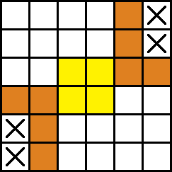 

섣불리 분할을 시도한 결과 상대의 반격으로 앞에서 설명한 (2, 2)와 같은 상황이 만들어졌습니다. 상대의 노림수에 제대로 걸려든 모습입니다.

### 2) 사례 2: 칸 수 조절

Nim tetris에서 게임의 초반부는 양 플레이어가 서로 자신있는 형태로 판을 짜 가는 단계이며, 여기에는 명확한 승리 공식이라 할 만한 것은 없습니다. 그러나 잠재적으로 승률을 끌어올릴지도 모르는 방법은 존재합니다. 보드 위의 아직 채워지지 않고 남아있는 칸의 갯수를 조절하는 방법이 바로 그것입니다.

한국에서 잘 알려진 Nim의 파생 게임 중에는 [베스킨라빈스 게임](https://en.termwiki.com/EN/%EB%B2%A0%EC%8A%A4%ED%82%A8%EB%9D%BC%EB%B9%88%EC%8A%A431_%EA%B2%8C%EC%9E%84_%E2%82%80%E2%82%81)이라는 것이 있습니다. 이 게임은 참여자들이 차례를 정해 1부터 31까지의 수를 말하는 간단한 게임으로, 한번에 3개까지 수를 말할 수 있으며 마지막 수 31을 말한 사람이 패배합니다.

베스킨라빈스 게임은 2인 플레이시 선공에게 간단한 필승 전략이 존재하는 것으로 유명합니다. 첫 턴에 2개의 수를 말하고 이후 상대가 1개의 수를 말하면 3개의 수를, 2개의 수를 말하면 2개의 수를, 3개의 수를 말하면 1개의 수를 말하는 것입니다. 이러면 상대가 자신의 턴에 말해야 할 첫 번째 숫자는 3, 7, 11, 15... 등으로 4씩 증가하는 수열을 이루게 되며, 결국 상대는 이 수열에 속하는 31을 부를 수밖에 없게 됩니다.

이 전략은 Nim tetris에도 부분적으로 적용할 수 있습니다.  Nim tetris에서 한 턴에 사라지는 남은 보드 영역의 크기는 대부분 마크되는 영역을 합쳐 4~7칸 정도입니다. 상대가 소모시킨 영역의 크기에 따라 소모시킬 영역의 크기를 조절한다면 상대 턴이 끝난 후 다시 상대 턴이 돌아올 때까지 소모되는 칸의 크기를 10또는 11칸으로 일정하게 유지시킬 수 있습니다.

가령, 상대 턴의 남아있는 칸 수를 25칸으로 하고 싶다면 미리 상대 턴의 칸 수를 35또는 45칸으로 맞춤으로써 어렵지 않게 목적을 달성할 수 있을 것입니다.

베스킨라빈스 게임과 달리 Nim tetris에서는 이러한 전략이 확실히 승리를 보장하지는 않으므로 주의하십시오. 게임의 후반부에서는 앞서 소개한 분할과 같은 확실한 승리 공식들이 훨씬 더 중요합니다. 칸 수 조절은 이러한 승리 공식을 사용하기 전에 게임에서 유리한 고지를 선점하기 위한 수단이 될 수 있을 것입니다. 
